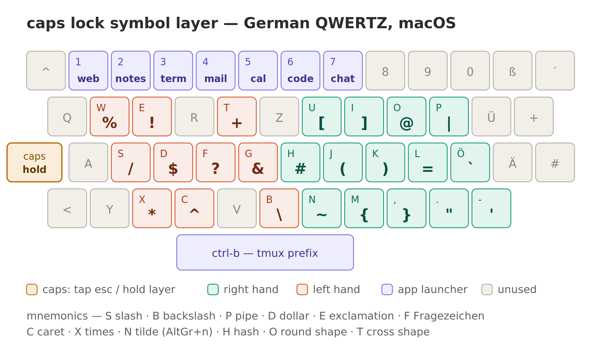

# Erik's personal config and setup init
This repository contains a script to setup a new machine with all my opinionated setup configurations and scripts

## Requirements
- Only applicable to macOS or linux
- Custom keyboard bindings only apply to german keyboard layout

Following programs are expected to be installed and setup, before running the `init.sh` script
- [Karabiner](https://karabiner-elements.pqrs.org/)

## Keyboard layout
The caps-lock key is repurposed to i) activate a symbol layer when hold and ii) act as escape key when pressed alone

